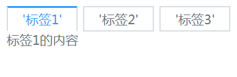
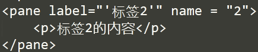
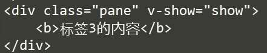

# 组件

这是一个非常普通的概念。今天有些新的理解。下面以实现这个选项卡组件为例来说明。



## 思路1：
第一眼看过去，这个组件可以分成 “标签项”和“内容项”两个部分。
```
<tab>
	<template :titles='titles' :contents="contents">
		<div class="table-tile">
			<span v-for="title in titles">{{title}}</span>
		</div>
		<div class="table-content">
			<div v-for="content in contents">{{content}}</div>
		</div>
	</template>
</tab>
```
这个想法比较直接，简单，接下来你只需要去设置两个数据项：titles，contents就可以了。

但也有一个明显的问题：可能每一个选项卡的内容会各不一样，不会只有简单的文本。另外，在使用这个tab组件时，传递数据的方式也比较死板。

下面看第二种思路。

## 思路2：
把tab中每一个选项卡看作一个组件，即理解为两个组件：外层是tabs，它表示一个容器；内层是多个并列的pane，表示一个一个的面板.在对tabs 进行初始化时，把pane中的标签信息（即如下的label）提取出来，放在上部，形成一个选项卡的效果。

使用方法如下：
```
<tabs>
	<pane label="'标签1'" name = "1">
		<h1>标签1的内容</h1>
	</pane>
	<pane label="'标签2'" name = "2">
		<p>标签2的内容</p>
	</pane>
	<pane label="'标签3'" name = "3">
		<b>标签3的内容</b>
	</pane>
</tabs>
```
这样，在用户的角度，就比较直观了。现在，我们从使用的方法去反推tabs和pane这两个组件的实现方式。

### pane组件

#### 模板
```
<template>
	<div class="tabs">
	  <div class="tabsBar">
	  	<span v-for ="(item,index) in navList" 
	  		@click = 'handleChange(index)'
	  		:class="tabCls(item)">{{item.label}}</span>
	  </div>
	  <div class="tabsContent">
	  	<slot></slot>
	  </div>
	</div>
</template>
```
它的结构中有一个很特殊的slot，即这里的slot中要装入的是三个pane，即如下的结构会被装入slot中。
```
	<pane label="'标签1'" name = "1">
		<h1>标签1的内容</h1>
	</pane>
	<pane label="'标签2'" name = "2">
		<b>标签3的内容</b>
	</pane>
	<pane label="'标签3'" name = "3">
		<b>标签3的内容</b>
	</pane>
```

#### 获取所有pane组件中的label
使用$children可以获取所有的子元素，然后再通过$options中的name去做筛选，把所有的pane全部选出来。
```
getTabs: function () {
	return this.$children.filter(function (item) {
		return item.$options.name === 'pane'
	})
}
```
选出来之后，当然就可以封装自己的属性navList了，然后在span元素上用v-for

下面再来看pane组件
### 模板

```
 <template>
 	<div class="pane" v-show="show">
		<slot></slot>
	</div>
</template>
```

把 变成  。 nice!


## 小结
1. slot 在定义组件时，用处非常大：在组件中留出一块空白，让用户自己去填内容。
2. 用$chilren去获取子组件，然后再做数据加工。

## 参考
[vue.js实战](https://www.iviewui.com/vue-book)。

