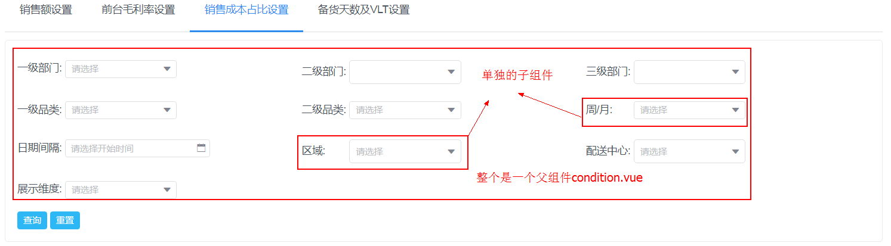

# 在父组件中直接调用子组件的方法

## 背景
项目中很多地方都需要用到条件选择项。如下：

所以进行封装，把所有的条件都封装在一个组件中。

## 问题

1. 在不同的页面上，condition.vue这个组件中的下拉列表是不同的。有些地方有三级部门，有些地方可能没有。
2. 在不同的页面上，同一个下拉列表的状态是不同的。有些地方支持部门多选，有些地方不支持。
3. 在点击查询后，要能够从condition.vue这个组件中得到当前的各个下拉列表的状态。

## 解决方案
对condition.vue这个组件来说：
（1） 有一个属性，在不同的页面中，通过这个属性传递给它不同的值，来决定哪些下拉列表需要显示出来，并且设置详细配置参数
（2） 有一份默认设置。在通过props获取具体的页面上传递的值之后，与这个默认设置进行组合，得到最终的配置项。
（3） 向外部暴露一个方法:getCondition()。用这个方法来返回当前的各个下拉列表的状态。
 
## 技能点
（1）this.$refs ： 获取组件的索引
（2）直接调用组件的方法：this.$refs.refName.method1()

